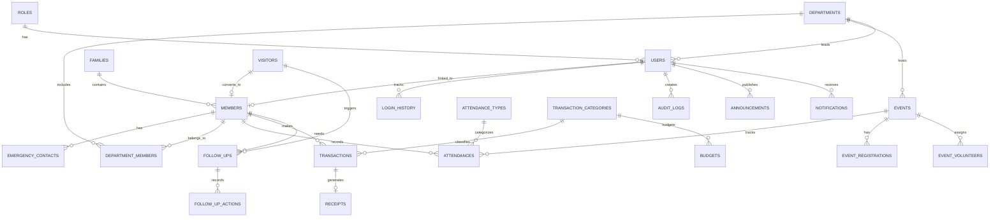

# Database ER Diagram — AG CMS

## Entity Relationship Overview

## Core Tables

### Authentication & RBAC

| Table | Description | Key Fields |
|-------|-------------|------------|
| `roles` | RBAC role definitions | name, permissions (JSON) |
| `users` | User accounts | username, email, role_id, member_id |
| `login_history` | Login audit trail | user_id, ip_address, success |

### Members

| Table | Description | Key Fields |
|-------|-------------|------------|
| `members` | Church members | membership_id, qr_code, family_id |
| `families` | Family groupings | family_name, address |
| `emergency_contacts` | Emergency contacts | member_id, name, phone |
| `visitors` | First-time visitors | visit_date, follow_up_status |

### Operations

| Table | Description | Key Fields |
|-------|-------------|------------|
| `attendances` | Attendance records | member_id, date, type_id |
| `attendance_types` | Service types | name |
| `transactions` | Financial records | type, amount, category_id |
| `transaction_categories` | Income/expense categories | name, type |
| `budgets` | Budget allocations | amount, period, year |
| `receipts` | Generated receipts | transaction_id, receipt_number |

### Organization

| Table | Description | Key Fields |
|-------|-------------|------------|
| `departments` | Ministries/departments | name, leader_id |
| `department_members` | Department assignments | department_id, member_id, role |
| `events` | Church events | title, start_date, event_type |
| `event_registrations` | Event sign-ups | event_id, member_id |
| `event_volunteers` | Volunteer assignments | event_id, member_id, role |

### Communication & Follow-Up

| Table | Description | Key Fields |
|-------|-------------|------------|
| `announcements` | Church announcements | title, content, priority |
| `notifications` | User notifications | user_id, is_read |
| `follow_ups` | Follow-up tasks | member_id, type, status |
| `follow_up_actions` | Follow-up actions taken | follow_up_id, action_type |

### Audit

| Table | Description | Key Fields |
|-------|-------------|------------|
| `audit_logs` | System audit trail | user_id, action, module, old/new values |

## Indexes

- `members.membership_id` — Unique, indexed
- `members.qr_code` — Unique, indexed
- `attendances.date + attendance_type_id` — Composite index
- `transactions.transaction_date` — Indexed
- `audit_logs.created_at` — Indexed
- `users.username, users.email` — Unique, indexed

## Normalization

The schema follows Third Normal Form (3NF):
- No repeating groups (departments, contacts in separate tables)
- All non-key attributes depend on the primary key
- No transitive dependencies (categories separate from transactions)
